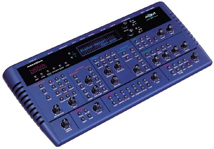
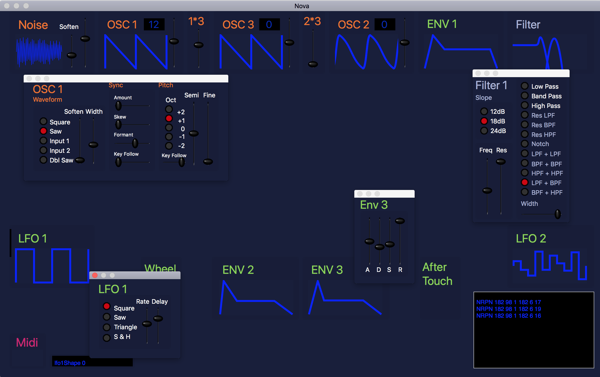
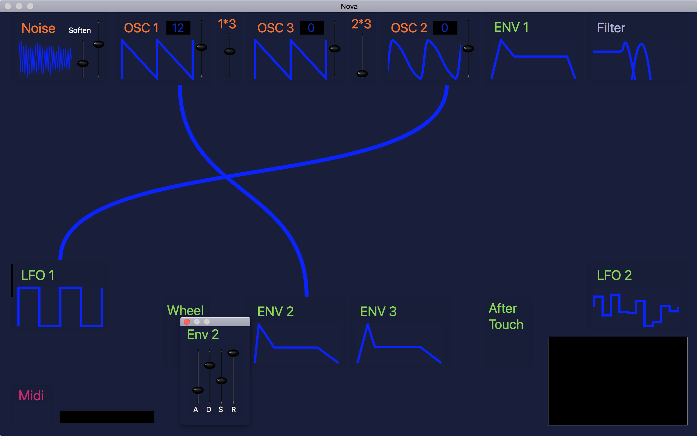
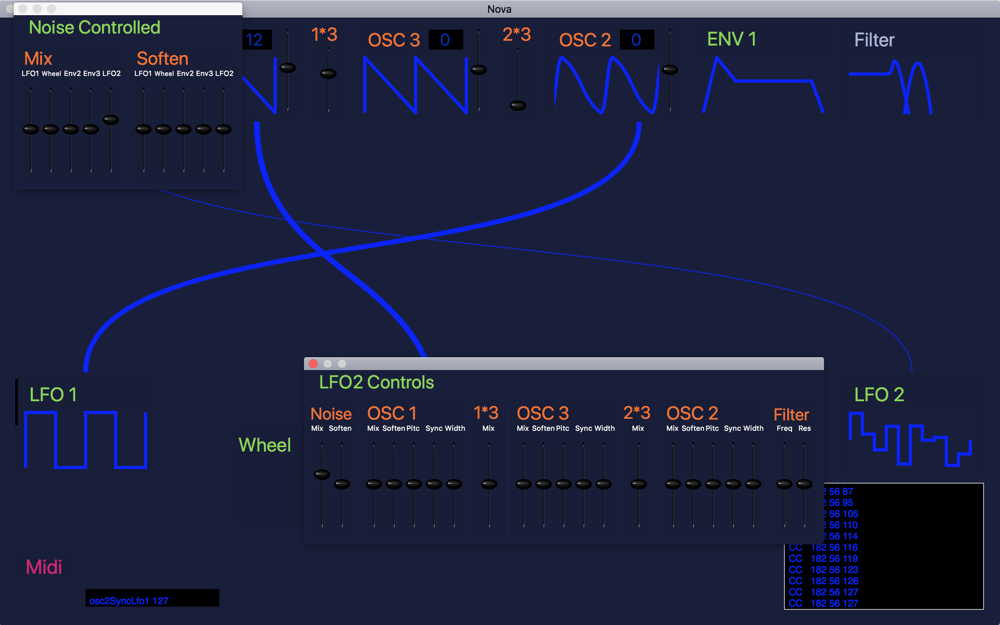

# Nova

An old project, incomplete, but close. Designed to make it easier to understand and change settings on a novation nova. 

When I stopped working on it I had just implemented the display of the connections between the various modules of the nova. These show clearly which modules are being controlled by which other modules. This is something that is not at all obvious on the nova itself and is the main reason for developing this program. Here is a shot where LFO1 is controlling OSC2 and ENV2 is controlling OSC1. 

The width of the lines is designed to represent the amount of control being exerted. This can be adjusted from either end of the connection, and can be positive or negative. Currently +64 appears the same as -64.

Relies on the now unsupported PYMidi library. I have a modified version compiled under OSX 10.13 in another repository that nova uses. This is just to get the thing working again so I can recycle the good bits for a new version which won't rely on any apple products. 

Quite a lot of the code is generated in the build phases. There are hundreds of very similar midi calls, all of which needed getters and setters and initialisation. Rather than hand code them all there are lists in the parameters directory and these are used to generate things using awk and shell.

The notes below are from 2004/2005

Current State:

10th Jan:
PYController sets up midi reception and transmission. Just echoes recieved MIDIPacketList back to midiout. 
Test button causes midi interfaces to be redetected.

13th Jan:
filters midi packets and outputs just the notes and cc's in an NSTextView window.

19th Feb:
All CC's and NRPNs covered now. Prog and NovaController classes make use of #include statements to include files 
that are generated by sed in shell script build phases that are run before the compilation of the classes
there are currently 3 Data files that are used as input to these sed scripts. It is now possible to change
a parameter name, or add one, and the associated access methods, case statement in the incoming midihandling
proceedure and the IBActions to connect the parameter to IB are all created automatically.

CC contains all the CC codes
NRPN contains all the NRPN codes where the full range of byte 6 is allocated to the one parameter
NRPNBits contains all the NRPN codes where the code is shared between more than one parameter

The format is:
int             string          string          int
"NRPN/CC code" "ParameterName" "parameterName" "Sysex Index"
the same for all three files

14th March:
NRPNbits is now split into parts NRPNButtons and NRPNParts:
NRPNButtons contains all the NRPN codes that are set by radio buttons
NRPNParts contains all the NRPN codes that are set by sliders but are not 0-127

25th March:
Waveform display for square/saw waves with soften and pulseWidth done.
Need to look at NRPNButtons now in NRPNCases. Better automate this, but it will mean adding more info to the 
parameter files. Probably need a start value and end value. This will be usefull for NRPNParts too.

21st Nov:
CCConnections and NRPNConnections now contain all the parameters that need to draw connecting cables.
Windows and panels now accept key presses. They are subclassed (IWWindow IWPanel) to do this.
Considering adding light up sliders that respond to incoming midi signals. From IWDarkSlider:

//How about a setLit method? changes knobImage[VH] to be a version with a red centre
//This would be called before (and reset after) a slider is set by incoming midi, from
//buildCCCases etc.

3rd March:
Now uses defaults system to store window positions and default vals for all IWProg variables. 
Working on storing current values of all prog values in the defaults system. Means every one of
IBActions will have an extra line, but it will mean that no save is necessary on close of the program.

24th March:
Current values stored in defaults system. Need to implement save function and start testing sysex dump
from Nova, then implement triggering sysex dump from NovaController.

2nd May:
Midi channel is not being changed for outgoing signals. Sysex is now being recieved but not many 
controls are being changed. Changing osc1wave from the synth doesn't update the IWButton display.
Pitch fine works, but octave and semi don't.

30th July:
Filtertype isn't initialised correctly. Sysex loads ok, but something strange going on with the update
of IWCableView. Looks like it isn't getting cleared properly. And there are many missconfigured links
in it.
